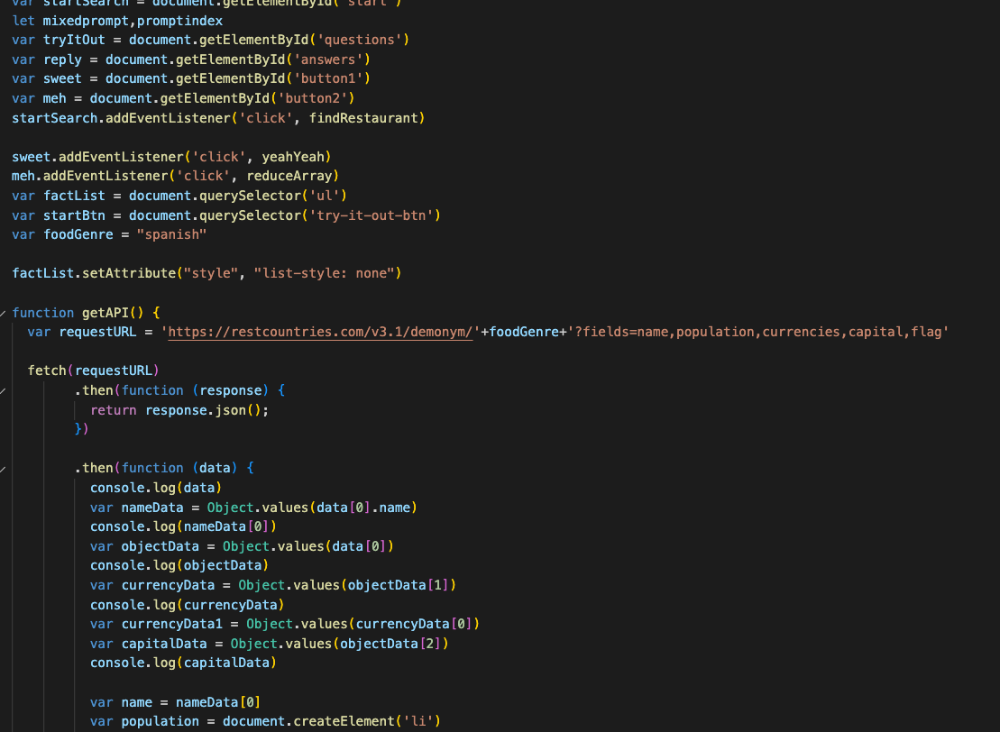
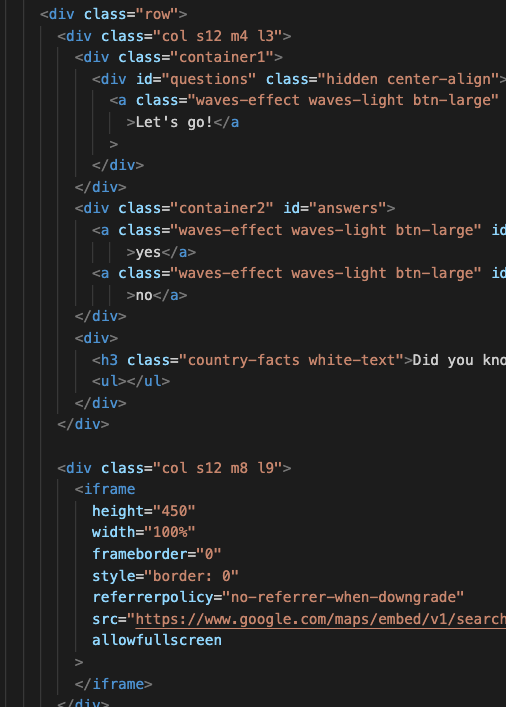
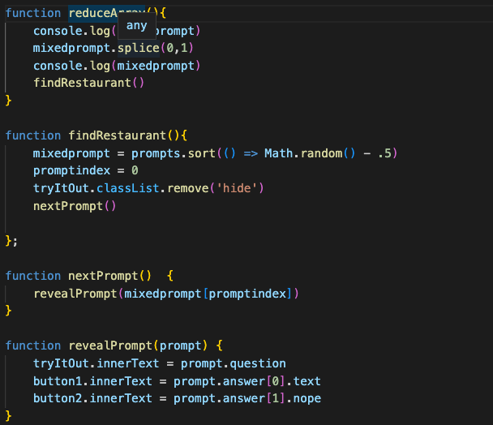
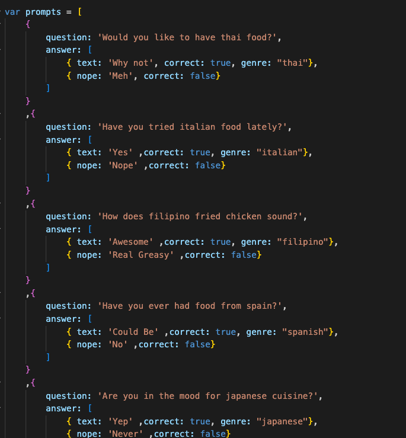
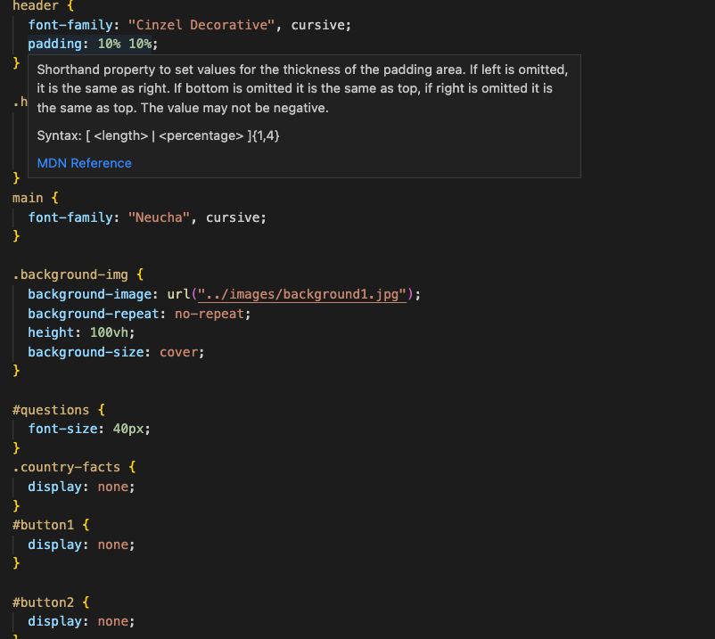

# Suya:
A new dining experience.
## Description:
Suya is an app designed to expand the pallet and knowledge of the user.  It isn't so much an app that allows the user to search for a restaurant, so much as an app that presents the user with questions about the foods they like and what they are open to trying.  As soon as the user approves of anything the map will locate restaurants that fit that parameter.  At the same time facts about the country of origin and its peoples will occupy a space to the left of the map.  The display was built with Materialize, the questions and prompts are kept in javascript and appear randomly, the array of prompts is reduced with each question, so the same question is never asked more than once.  The current time and date are displayed at the top of the screen.
## Screenshots:

## Links:
github repo: https://github.com/bmckenzie88/suya

deployed site: https://bmckenzie88.github.io/suya/

